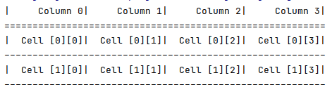

# BaseConvertor
A convertor for decimal to any other base system
# Group Members
- ####120574 Samson Mwathi
- ####116814 Tony Mogoa
- ####121353 Samuel Bryan
- ####119742 Georgina Njoroge
#Report
The report is in the pdf named `Assignment #2`.
#Documentation
### Table Utility
The Table class provides simple functions to quickly render tables in a CLI program.

To render a table:
1. Pass the table header(array), table data(2d-array) and alignment to the constructor
   
    The header is just a simple array like below:
    
    `private static final String[] header = {"S/No.", "Decimal Number", "Binary Number", "Remarks"};`
    
    The data is a 2d array which can be like below:
    
    `private static final String[][] data = {{"S/No.", "Decimal Number", "Binary Number", "Remarks"}, {"S/No.", "Decimal Number", "Binary Number", "Remarks"}};`
    
    For the alignment pass `Alignment.RIGHT` to get right-alignment and `Alignment.LEFT` for left-alignment
2. Call the render() function.
### Snippets
###### Rendering a table
```java
public class Main {
    public static void main(String[] args){
       String[] header = {"Column 0", "Column 1", "Column 2", "Column 3"};
       String[][] data = {{"Cell [0][0]", "Cell [0][1]", "Cell [0][2]", "Cell [0][3]"}, {"Cell [1][0]", "Cell [1][1]", "Cell [1][2]", "Cell [1][3]"}};
       Table table = new Table(header, data, Alignment.RIGHT);
       table.render();
    }
}
```
**Result**


###### Dynamically populating a 2d array
```java
public class Main{
    public void generateTableData(){
       String[] header = {"Column 1", "Column 2", "Column 3"};
       String[][] data = new String[23][3];// 23 rows 3 column
       for (int i = 0; i < 19; i++) {
           //creating a row
           String[] row = {Integer.toString(i), Integer.toString(i + 10), Integer.toString(i - 10)};
           //adding row to 2-d array
           data[i] = row;
       }
    }
}
```